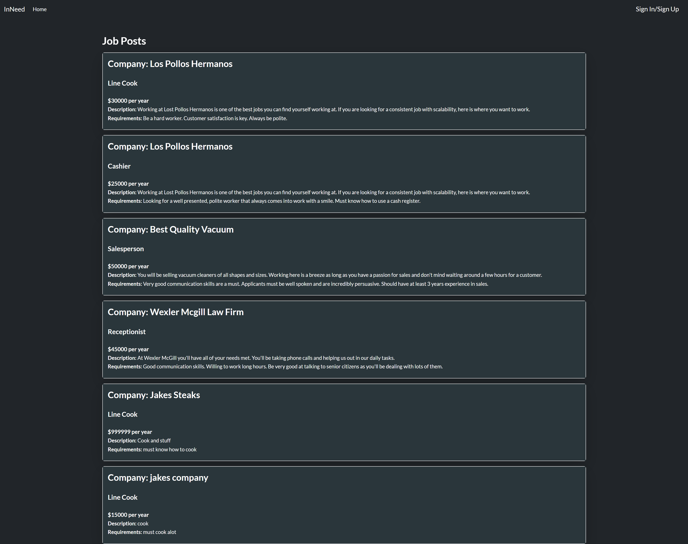

# InNeed

## Description

InNeed is an application that allows employers to create job postings that potential future employees can browse and apply for the open positions. The application utilizes Express, MySQL (using Sequelize) and Handlebars to create a responsive application that is intuitive and easy to use.

## Table of Contents
- [Installation](#installation)
- [Usage](#usage)
- [License](#license)
- [Contributing](#project-contributors)
- [Tests](#tests)
- [Screenshot](#screenshot)
- [Link to Application](#deployed-heroku-link)
- [Questions](#questions)

## Installation
This project requires some dependencies, node as well as mysql dependencies to be installed locally on your machine. Below are links to videos demonstrating how to install the packages. For demonstration purposes, the application will use Insomnia to demonstrate the functionality of the application.

**Note: If you are using the deployed Heroku site, you can ignore this section.**

[Node.js Installation Walkthrough Video](https://youtu.be/q5uAZbd4r3I)  

Once you have Node.js installed, open the terminal and type the following:

```
npm install
```
You will need to set up a .env file.
This can be done by creating a file named .env in the root directory of the folder structure, and using the .env.EXAMPLE as a reference to what values need to be entered.
## Usage

When first starting the application, you will be on the homepage. This is where the existing job posts will be displayed, showing various information about them.

In the navigation bar at the top of the page will be a Sign In/Sign Up button. Click here to be brought the the login page. If you do not have an account, you can create one by clicking on the link at the bottom of the form.

If you created an account as an Employer, this will grant you the accessibility to create new job posts. To do so, click on "New Post" in the navigation bar. Here, you can enter the details of the job and create a new post.

Additionally, as an employer, you can view the posts that you have created through the dashboard. To do so, click on "Dashboard" in the navigation bar.


## License


This project uses the MIT license.

## Project Contributors

[Carter Michaud](https://github.com/Cmeesh11)

[Jacob Milojkovich](https://github.com/Jakemilo1)

[Owen Olson](https://github.com/owennolson)

[Nate Long](https://github.com/Tunestring)


## Tests

If you are using the repository for testing purposes, it is recommended that you seed the database.

This can be done by typing ```npm run seed``` into the terminal.

## Screenshot



## Deployed Heroku Link
[Link](https://limitless-bastion-45825.herokuapp.com/)

## Questions

Check out our repositories by clicking on the project contributers name above!